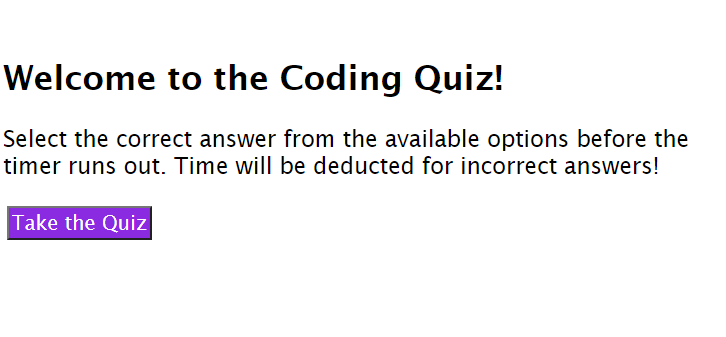
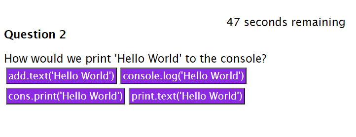

# Homework 4: Code Quiz

For this week's homework I have created a javascript quiz of five questions. The tasks to complete were as follows:

    WHEN I click the start button
    THEN a timer starts and I am presented with a question

    WHEN I answer a question
    THEN I am presented with another question

    WHEN I answer a question incorrectly
    THEN time is subtracted from the clock

    WHEN all questions are answered or the timer reaches 0
    THEN the game is over

    WHEN the game is over
    THEN I can save my initials and my score

The link for the project is as follows: https://empipio.github.io/h4-code-quiz/
